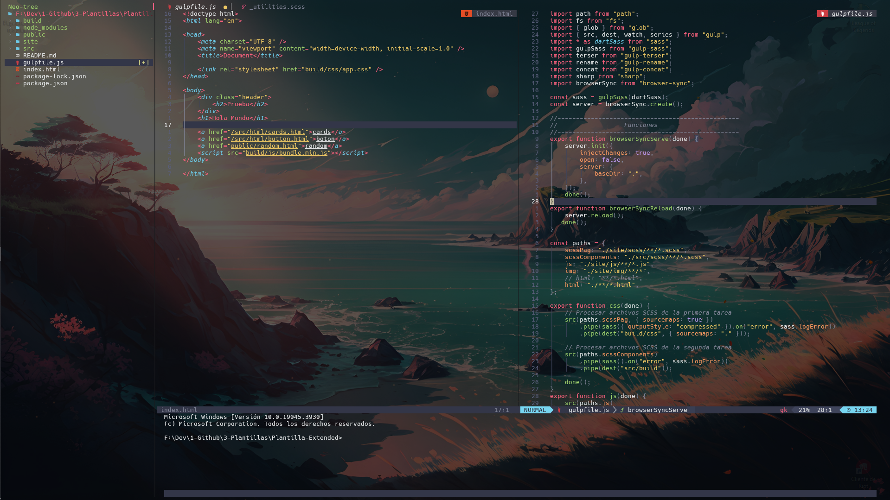
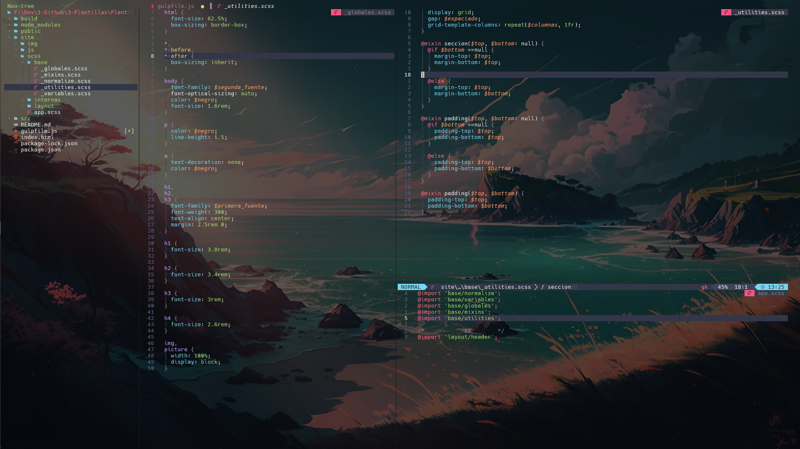
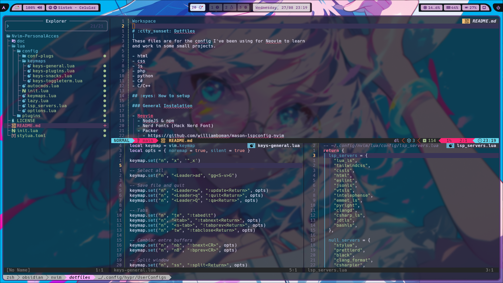

- **LazyVim**
  

  

- **Nvim (packer)**
  

# :city_sunset: Dotfiles

These files are for the config I've been using for Neovim to learn
and work in some small projects.

- html
- css
- js
- php
- python
- C#
- C/C++

## :eyes: How to setup

First of all we need to install windows terminal and configure oh my posh,
it support's the following languajes:

The fastest way to get my posh

```bash
winget install JanDeDobbeleer.OhMyPosh -s winget
```

### :bulb: Oh my posh

- https://ohmyposh.dev/docs/

## :diamonds: Requirements and tools

**_Install on Windows_**

### For Neovim

- NodeJS & npm
- Nerd Fonts (Hack Nerd Font)
- Packer
  - https://github.com/wbthomason/packer.nvim
- C compiler (environment variables)
  - https://github.com/niXman/mingw-builds-binaries/releases

### LazyVim

- C compiler (environment variables)

  - https://github.com/niXman/mingw-builds-binaries/releases

<br>

- **Windos Terminal**
  - Powershell
  - Oh my posh
  - Nerd Fonts (Hack Nerd Font)

<br>

- **Dependencies NPM**

  - pylint

    `pip install pylint `

  - prettier

    `npm install -g prettier`

  - eslint_d

    `npm install -g eslint_d`

## :crystal_ball: Neovim setup

```
📂 $env:LOCALAPPDATA\nvim
├───📂lua/
|     └──📂configs/
|     └──🔰maps.lua
|     └──🔰plugins.lua
|     └──🔰settings.lua
├───📂plugin/
└───init.lua
```

## :rocket: Installation

Clone the repository.

```bash
https://github.com/WildKyuri/Dotfiles
```

### Neovim

Moves de files inside `Dotfiles/configs/nvim` to

- Windows: `$env:LOCALAPPDATA\nvim\`

In Neovim Editor, run the command:

```bash
:PackerSync
```

### LazyVim

Moves de files inside `Dotfiles/configs/nvim` to

- Windows: `$env:LOCALAPPDATA\nvim\`

And just run nvim in terminal

## Customization

- Lualine
  - https://github.com/nvim-lualine/lualine.nvim/blob/master/THEMES.md#codedark
- Dashboard
  - https://github.com/nvimdev/dashboard-nvim/wiki/Ascii-Header-Text

<!--
Adding Snippets
https://www.youtube.com/watch?v=FmHhonPjvvA&t=5s
-->
