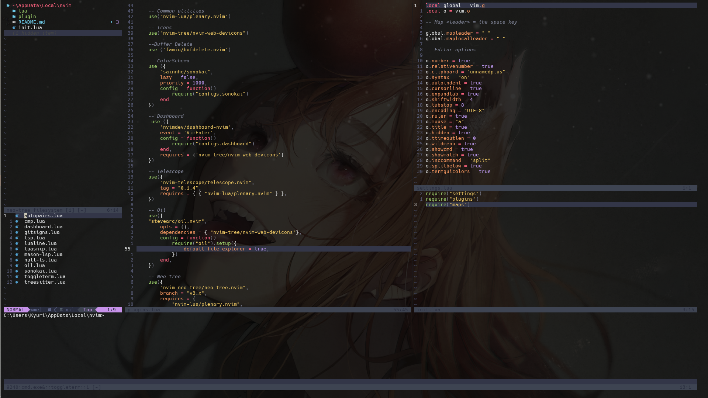

# :city_sunset: Dotfiles

Here you will find many configs for:

- Tools
  - nvim
  - zsh
  - powerlevel10k
  - fastfetch

- Terminals
  - kitty
  - wezterm
  - Windows Powershell

- Tiling Windows Manager
  - GlazeWM (Windows)
  - Hyprland (Arch)

## Hyprland

All configs for: (**pc** / **laptop** )

- waybar
- hyprlock
- hyprpaper
- hypridle
- swaync

## Neovim

### :diamonds: Requirements and tools

- NodeJS & npm
- Nerd Fonts (Hack Nerd Font)
- C compiler (environment variables Win)
  - https://github.com/niXman/mingw-builds-binaries/releases
- fd
- fzf
- ripgrep
