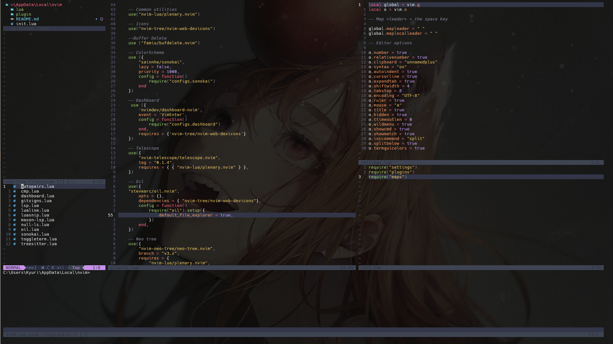

# :city_sunset: Dotfiles

These files are for the config I've been using for Neovim to learn
and work in some small projects.

- html
- css
- js
- php
- python
- C#
- C/C++

## :eyes: How to setup

### General Instalation

- **Neovim**
  - NodeJS & npm
  - Nerd Fonts (Hack Nerd Font)
    - https://github.com/williamboman/mason-lspconfig.nvim
  - C compiler (environment variables)
    - https://github.com/niXman/mingw-builds-binaries/releases (x86 64 posix seh msvcrt)

## :rocket: Installation

Clone the repository.

```bash
https://github.com/WildKyuri/Dotfiles-Nvim.git
```

Move de config files into the config depending where you are working

- Windows: `$env:LOCALAPPDATA\nvim\`
- Linux: `~/.config/nvim`

Launch:

```bash
nvim
```

### :crystal_ball: Structure

```
📂 Path Config
.
├── init.lua
├── LICENSE
├── lua
│   ├── 📂config
│   ├── 📂keymaps
│   │   │   ├── 🔰keys-general.lua
│   │   │   ├── 🔰keys-plugins.lua
│   │   │   ├── 🔰keys-snacks.lua
│   │   │   └── 🔰keys-toggleterm.lua
│   │   ├── 📂conf-plugs
│   │   │   ├── 📂dap
│   │   │   │   ├── 🔰csharp.lua
│   │   │   │   ├── 🔰dap_setup.lua
│   │   │   │   ├── 🔰init.lua
│   │   │   │   └── 🔰python.lua
│   │   │   ├── 🔰autosessions.lua
│   │   │   ├── 🔰gitsigns.lua
│   │   │   ├── 🔰mason.lua
│   │   │   ├── 🔰null_ls.lua
│   │   │   ├── 🔰toggleterm.lua
│   │   │   └── 🔰ui.lua
│   │   ├── 🔰init.lua
│   │   ├── 🔰autocmds.lua
│   │   ├── 🔰keymaps.lua
│   │   ├── 🔰lazy.lua
│   │   ├── 🔰lsp_servers.lua
│   │   └── 🔰options.lua
│   └── 📂plugins
        ├── 📂snippets
│       │   ├── 🔰latexObs.lua
│       │   ├── 🔰mermaid.lua
│       │   ├── 🔰obsidian.lua
│       │   └── 🔰progra.lua
│       ├── 📂themes
│       │   ├── 🔰catpuccin.lua
│       │   ├── 🔰init.lua
│       │   ├── 🔰kaganawa.lua
│       │   └── 🔰nightfox.lua
│       ├── 🔰autocompletations.lua
│       ├── 🔰debugging.lua
│       ├── 🔰files.lua
│       ├── 🔰luasnip.lua
│       ├── 🔰mason.lua
│       ├── 🔰snacks.lua
│       ├── 🔰someothers.lua
│       ├── 🔰ui.lua
│       └── 🔰utilities.lua
├── 🔰README.md
└── 🔰stylua.tom
```

## Customization

- Lualine
  - https://github.com/nvim-lualine/lualine.nvim/blob/master/THEMES.md#codedark
- Dashboard
  - https://github.com/nvimdev/dashboard-nvim/wiki/Ascii-Header-Text
  - https://www.w3schools.com/charsets/ref_utf_symbols.asp

  <!--
  Adding Snippets
  https://www.youtube.com/watch?v=FmHhonPjvvA&t=5s
  -->
